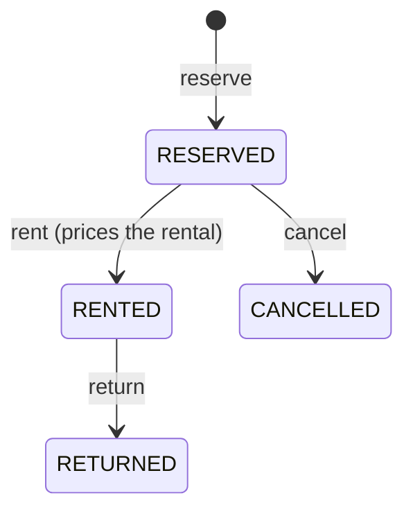

# Car Rental Management System

A backend web API for renting cars: browse available cars, reserve one for a time window, rent it (which prices the rental), return it, and manage reservations. The system enforces state and date rules, and guarantees that two reservations for the same car can never overlap.

## Tech stack

| | |
|---|---|
| Language / runtime | Kotlin 2.3, JDK 25 (provisioned by the Gradle toolchain) |
| Framework | Spring Boot 4.1 (Spring Framework 7), Spring Web MVC, Spring Data JPA, Bean Validation |
| Database | PostgreSQL 18, schema versioned with Flyway |
| API docs | springdoc-openapi (Swagger UI at `/swagger-ui.html`) |
| Build | Gradle 9.6 |
| Tests | JUnit 5, MockK, AssertJ, Testcontainers (real PostgreSQL 18) |

## Quick start

Requires Docker (for PostgreSQL) and a JDK to launch Gradle; the Gradle toolchain provisions JDK 25 automatically.

```bash
docker compose up -d        # PostgreSQL 18 on localhost:5432
./gradlew bootRun           # starts the API on localhost:8080 (Flyway migrates; a demo fleet is seeded under the default `local` profile)
```

Then explore the API via `requests.http`, or open Swagger UI at `http://localhost:8080/swagger-ui.html`.

Run the full test suite (spins up a throwaway PostgreSQL 18 via Testcontainers, so Docker must be running):

```bash
./gradlew test
```

`./gradlew check` (and CI's `./gradlew build`) also runs **detekt** static analysis; its ruleset lives in `config/detekt/detekt.yml`. detekt 1.23.x analyses in the Gradle JVM and its bundled Kotlin compiler cannot run on JDK 25, so CI launches Gradle on JDK 21 while the Kotlin toolchain still compiles and tests the app on JDK 25 (auto-provisioned via the foojay resolver) — mirroring the local setup.

## Architecture

A pragmatic layered Spring design — thin controllers, transactional services, Spring Data repositories over rich entities:

```
web/         REST controllers, request/response DTOs, @RestControllerAdvice (RFC-7807 ProblemDetail)
service/     transactional use cases (reserve, rent, return, cancel, availability)
domain/      the model: Car, Reservation (JPA entities that own their business rules), CarState, sealed DomainError
repository/  Spring Data JpaRepository interfaces (+ the availability / active-window queries)
config/      Clock bean, RentalProperties, demo data seeder
```

The entities *are* the model: the reservation state machine and the ceil-hour pricing live as methods on `Reservation` / `Car`, so there is one representation to reason about — no separate domain-vs-entity classes and no hand-written mapping layer. Invariants are enforced where they are cheapest and hardest to bypass: request shape by Bean Validation, the money/year/overlap rules by database `CHECK`/exclusion constraints.

## Domain model & state machine

A `Reservation` owns its lifecycle; the transitions are the state machine and live in one place:



A car is a catalogue entry; it does **not** store a mutable state column. Its current state (`AVAILABLE` / `RESERVED` / `RENTED`) and availability are **derived on read** from the reservation ledger. This removes a whole class of dual-write / state-drift bugs and avoids write contention on the car row.

The brief's "the car transitions to reserved / rented" *is* the reservation lifecycle above: a car's state is the live projection of that ledger, so the observable behaviour is the same — reserve a car for a window covering now and it immediately reads `RESERVED` — without a second copy of the truth (which a single stored state column could not provide anyway, since one car can hold several future bookings at once).

## The no-overlap guarantee (the centrepiece)

Reservations are time-windowed. The invariant "no two active reservations for the same car may overlap" is enforced by the database itself, atomically and race-proof, with a PostgreSQL GiST exclusion constraint:

```sql
CONSTRAINT reservations_no_overlap_active
    EXCLUDE USING gist (
        car_id WITH =,
        tstzrange(start_ts, end_ts, '[)') WITH &&
    ) WHERE (status IN ('RESERVED', 'RENTED'))
```

- `btree_gist` lets a scalar equality (`car_id`) and a range overlap (`&&`) share one GiST index.
- Half-open ranges `[start, end)` mean back-to-back bookings (`10:00–12:00` then `12:00–14:00`) do **not** conflict.
- The partial `WHERE` means only active bookings hold the slot; cancelled/returned rows free it for re-booking.

The database is the single source of truth for overlap: a violation surfaces as SQLSTATE `23P01`, which `ReservationService` catches and translates into a `409 Conflict` (`DomainError.OverlappingReservation`).

## Concurrency

Two concerns, both handled:

- **No double-booking under load.** Many users reserving the same window at once: the exclusion constraint guarantees exactly one insert wins — no application-level lock is needed. Losers surface as a clean `409`. Verified by `ConcurrentReservationTest` against real PostgreSQL.
- **No lost updates on transitions.** Each command runs in one `@Transactional` method; the managed entity's `@Version` enforces optimistic locking, so two concurrent `rent` calls on one reservation cannot both succeed.

A 3-second `lock_timeout` is set on every pooled connection (`SET lock_timeout`), so a request that blocks waiting on the exclusion constraint's predicate lock fails fast with a retryable error instead of pinning a connection indefinitely under contention.

## API

User identity is passed via an `X-User-Id` header (auth is intentionally out of scope — see below).

| Method | Path | Purpose |
|---|---|---|
| `GET` | `/api/cars` | all cars with current state |
| `GET` | `/api/cars/available` | cars free right now |
| `GET` | `/api/cars/{id}` | one car |
| `POST` | `/api/cars` | add a car |
| `POST` | `/api/reservations` | reserve a car for a window |
| `POST` | `/api/reservations/{id}/rent` | rent a reserved car (returns the price) |
| `POST` | `/api/reservations/{id}/return` | return a rented car |
| `POST` | `/api/reservations/{id}/cancel` | cancel a reservation (returns it as `CANCELLED`) |
| `PATCH` | `/api/reservations/{id}` | reschedule a `RESERVED` booking to a new window |
| `GET` | `/api/reservations` | the caller's reservations |
| `GET` | `/api/reservations/{id}` | one reservation (owner only) |

The collection endpoints (`/api/cars`, `/api/cars/available`, `/api/reservations`) are paginated via Spring Data `Pageable` query params (`?page=`, `?size=`, `?sort=`) and return a stable `{ content, page, size, totalElements, totalPages }` envelope. Ordering is deterministic by default — cars by `make, model, id` (`@SortDefault`), reservations by most recent window first with `id` as tiebreaker — so pages never shuffle between requests. Page size defaults to 20 and is bounded (`max-page-size: 100`); an unknown `?sort=` property is a `400` rather than a `500`.

Errors use RFC-7807 `application/problem+json`: `404` not found (a reservation owned by another user is reported as not found, so foreign ids cannot be enumerated), `409` conflict (overlap / illegal state transition / lock contention), `422` unprocessable business input (bad dates, duration bounds, dates beyond the supported calendar range, renting outside the rental window), `400` malformed request or invalid body field / missing header, `503` when the connection pool is momentarily exhausted (retryable). Every response also carries a stable machine-readable `code` and a `type` URI so clients can branch without parsing `detail`.

## Business rules & assumptions

- Rental window is `start` + `end` (ISO-8601, UTC `Instant`s); `end` must be after `start`, `start` must not be in the past, and both must fall within the supported calendar range (`≤ 9999`) so an absurd far-future date is a clean `422` rather than a database overflow.
- A reservation can only be rented (picked up) once its window has started and before it ends; renting outside the window is a `422 Unprocessable Entity` — the booking is in a valid `RESERVED` state, only the timing is wrong, which is distinct from a `409` state conflict (already rented/returned/cancelled).
- Duration bounds are configurable (`rental.min-duration` / `rental.max-duration`, default 1 hour to 30 days).
- Price = `pricePerHour × billable hours`, where any started hour is charged in full (ceil), computed with `BigDecimal`. Billing is on the **booked window**, quoted when the car is rented; returning early does not reduce the price. Returning **after** the booked `end` adds a late fee — the same ceil-hour rate applied to the overtime — computed at return (usage-based / early-return pricing would be a follow-up).
- `pricePerHour` is bounded to `(0, 10000]` at both the API edge (`@DecimalMax` → `400`) and the database (`CHECK`). This caps the largest computable total (`10000 × 720h` over the 30-day max, plus any late fee) well within the `numeric(13,2)` price column.
- Time is always UTC; a `Clock` is injected so date logic is deterministic and testable.

## Design decisions & trade-offs

- **Derive car state on read** rather than store it — keeps the catalogue and the booking ledger from drifting and removes write contention. A car with only a future booking correctly reads `AVAILABLE` now.
- **Availability is window-based** (deliberate, and pinned by tests). State and availability are derived from reservation *windows*: a car is occupied only while a reservation's `[start, end)` covers the current instant. A consequence is that a `RENTED` reservation left un-returned past its `end` no longer occupies the car — overdue possession is modelled as an operational concern (an overdue surcharge or a sweeper job), not a booking-time block. Usage-based occupancy (occupied until physically returned) is the obvious alternative; it is out of scope here.
- **Database-enforced overlap** (exclusion constraint) instead of an application check — the only way to be correct under concurrency, and it means `reserve` needs no application-level lock.
- **Entities are the model, used directly through Spring Data.** For a system this size a separate pure-domain layer with hand-written entity mapping is ceremony that earns nothing; the business rules (state machine, pricing) live as methods on the entities, and a change like adding a field touches one class, not six. Identity fields are `val` and every state-machine field has a `protected set` (`private set` is impossible: the all-open plugin opens entity members for Hibernate, and open properties cannot have private setters), so the transition methods (`rent`, `returnCar`, `cancel`, `reschedule`) are the only way to mutate a reservation. Invariants that must never be bypassed are pushed into the database (`CHECK`, exclusion constraint) rather than duplicated in Kotlin.
- **Optimistic `@Version` on the entity.** Every mutating use case is a single `@Transactional` read-modify-write, so the managed entity carries the version check end-to-end.
- **`userId` is an opaque string** carried in a header; there is no user table and no real authentication. Real auth (Spring Security / JWT) is the obvious next step.
- **One source of truth for time** — temporal rules (`start` not in the past, `end` after `start`, rentable only within the window) live in the domain and read the injected `Clock`, not Bean-Validation `@Future` annotations (which would silently use the JVM system clock and split the same error across `400`/`422`).
- **No comments by design** — the code is meant to read on its own; rationale lives here.

## Testing

Around 80 tests across four layers; every integration test runs against a real PostgreSQL 18 via Testcontainers (a single shared container, fixed clock for deterministic time), so the Flyway migration and the exclusion constraint are exercised exactly as in production:

- **Domain unit tests** — the reservation state machine including the boundary instants of the half-open window (rentable at exactly `start`, not at exactly `end`), derived car state and its `RENTED`-over-`RESERVED` precedence, ceil-hour pricing, the late fee.
- **Service tests** (mocked repositories, fixed clock) — temporal validation and duration bounds, ownership checks, pricing and late-fee orchestration.
- **API integration tests** — the full lifecycle over MockMvc; the error contract (status, `problem+json` body and stable `code`) for every failure mode; illegal state-machine transitions over HTTP (double rent/return, cancelling a rented booking, rescheduling a rented one); reschedule flows including into a window overlapping the booking's *own* current slot (the sharpest corner of the exclusion-constraint design); re-booking slots freed by both `CANCELLED` and `RETURNED`; malformed input (bad JSON, non-UUID id, unknown sort); ownership/IDOR; pagination and listing order.
- **Derived-availability tests** — service-level against the real database, pinning the half-open `[start, end)` boundary in the availability SQL (a reservation ending exactly *now* frees the car) and the window-based occupancy trade-off for overdue rentals.
- **Concurrency tests** — N threads racing to reserve the same window leave exactly one persisted winner (exclusion constraint); two concurrent rents of one reservation leave exactly one winner (optimistic `@Version`).

## Production considerations / what I would add next

- Authentication & authorisation (the `X-User-Id` header is a stand-in).
- Reservation expiry: a scheduled job to release stale un-picked-up `RESERVED` bookings (would add an `EXPIRED` status and a scheduler).
- Retry-on-conflict (client-side) for transient lock contention.
- Observability (metrics, tracing) and richer pricing (early-return refunds, tiered/seasonal rates).
